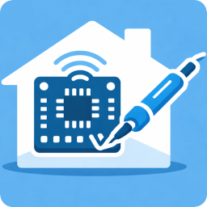

<p align="center">
  
</p>

# MyDevice for DIY
## Custom ESP32 Devices for Home Assistant (UDP Push Integration)

**MyDevice for DIY** is a project designed to make it as easy as possible to connect
**your own DIY devices** (for example based on **ESP32**) to **Home Assistant**.

This repository documents a **Home Assistant custom integration** and a deliberately
**simple UDP-based protocol** for self-built **room thermometers and hygrometers**.

The focus is on **low power consumption**, **robust data delivery**, and **full control**
over the protocol and data model.

---

## Key Features

- Push-based communication (no polling)
- UDP transport (lightweight, fast, simple)
- Ideal for battery-powered ESP32 devices
- Automatic device discovery in Home Assistant
- Immediate ACK with time synchronization
- No MQTT broker, no HTTP server required

---

## System Overview

### ESP32 Device (Client)

- Measures temperature and/or humidity
- Sleeps most of the time
- Wakes up periodically (e.g. every 5 minutes)
- Sends a single UDP datagram with the measurement
- Waits for an ACK
- Uses the ACK timestamp to synchronize its RTC

### Home Assistant (Server / Integration)

- Opens a configurable UDP port
- Receives measurement datagrams
- Sends an immediate acknowledgment (ACK)
- Automatically discovers unknown devices
- Creates Home Assistant devices and sensor entities

---

## UDP Protocol Specification

### Measurement Record (Record Type `11` – “ht”)

**Format**
```
<utc-timestamp>;<record-type>;<device-id>;<temperature*10>;<humidity*10>
```

**Example**
```
1768503477;11;RT001;225;514
```

**Field Description**

| Field | Description |
|-----:|-------------|
| `utc-timestamp` | Unix timestamp (UTC, seconds) |
| `record-type` | `11` = temperature & humidity |
| `device-id` | Unique device identifier |
| `temperature*10` | Temperature in °C × 10 (225 = 22.5 °C) |
| `humidity*10` | Relative humidity in % × 10 (514 = 51.4 %) |

---

### Optional / Missing Values

Individual values may be omitted:

```
;11;RT001;;514
```
→ humidity only

```
;11;RT001;225;
```
→ temperature only

---

### Timestamp Handling

#### Absolute Timestamp
```
1768503477;11;RT001;225;514
```

#### No Timestamp
```
;11;RT001;225;514
```
→ Home Assistant uses the receive time

#### Relative Timestamp (negative)
```
-40;11;RT001;225;514
```
→ measurement is 40 seconds old

Home Assistant converts relative timestamps into absolute UTC timestamps if system time is available.

---

## Acknowledgment (ACK)

**Format**
```
<utc-timestamp>;1
```

**Example**
```
1768503746;1
```

**Properties**
- Sent immediately after receiving a datagram
- Always contains the *current* UTC timestamp
- Used by the client to correct its RTC

---

## Client Retry Behavior

- Client sends a measurement record
- Waits for ACK
- If no ACK is received:
  - retransmits the same datagram
  - retries every second
  - keeps the same timestamp
- Stops retrying after an internal timeout

The server accepts duplicate packets and always responds with a fresh ACK.

---

## Home Assistant Integration Details

### Devices and Entities

- Each ESP32 device becomes **one Home Assistant device**
- For each device the following entities are created:
  - `sensor.<name>_temperature`
  - `sensor.<name>_humidity`

**Additional State Attributes**
- `measurement_ts_utc` – measurement timestamp
- `last_seen_utc` – last packet receive time

---

### Automatic Device Discovery

- A new `device-id` sends data
- Device appears under **Settings → Devices & Services → Discovered**
- User confirms and assigns a name
- Device and entities are created

---

## Configuration

### Config Flow

- Configure the UDP listening port
- Default: `45678`
- Only one listener per Home Assistant instance

### Options Flow

- Change the UDP port after setup
- Listener is restarted automatically

---

## Installation

1. Copy `custom_components/raumthermometer/` to  
   `config/custom_components/raumthermometer/`
2. Restart Home Assistant
3. Go to **Settings → Devices & Services → Add Integration**
4. Select **“MyDevice for DIY”**
5. Configure the UDP port

---

## Extensibility

MyDevice for DIY is intentionally kept simple and extensible:

- Battery voltage / level
- RSSI / signal quality
- Additional sensors
- Other DIY device classes

---

## Project Goal

**MyDevice for DIY** aims to provide a **small, robust, and easy-to-understand foundation**
for custom hardware projects integrated into Home Assistant — without unnecessary complexity.
